# azure-superpowers — TRACK 02

## 한 줄 소개
> **아이디어 한 문장 → 살아있는 Azure URL.** Superpowers가 코드를 완성하면, azure-superpowers가 배포까지 끝낸다.
> 가장 인기 있는 GHCP 하네스(Superpowers)에 **키리스 Azure 배포**를 입힌 애드온. `az` 명령 한 줄 몰라도, 채팅 두 마디면 제품이 인터넷에 뜬다.

## 해결한 문제
좋은 AI 코딩 하네스도 **코드 완성에서 멈춘다.** 검증된 코드라도 배포가 막히면 노트북 속 데모로 끝난다. `az`·Bicep·키 관리·자원 정리는 비개발자에게 높은 벽이고, **"잘 만들었는데 배포가 안 됨"**이 가장 흔한 실패다. azure-superpowers는 이 **마지막 1마일 — 코드에서 배포된 URL까지**를 메운다.

## Asset 목적
Superpowers의 깊이(spec·TDD·리뷰)는 손대지 않고, 그 뒤에 **로그인 게이트 → 리소스 매핑 → 키리스 배포**를 자동으로 이어 붙여 "완성된 코드"를 "살아있는 제품"으로 확장한다.

## 주요 기능
- **⛔ 0순위 로그인 게이트** — 작업 전 `az` 로그인·권한부터 확인. 실패하면 원인·할 일(역할 요청·리전·프로바이더)까지 안내해 배포 실패를 원천 차단
- **키리스 강제** — 관리 ID + RBAC. 연결문자열·API 키를 코드/커밋에 절대 생성 안 함
- **단일 RG + 자원 대장** — 모든 자원을 `rg-<앱>` 하나에. `az group delete` 한 방 정리, 비용 사고 방지
- **DB도 Azure로** — SP가 쪼갠 스키마를 App Service + Azure DB for PostgreSQL에 키리스 연결
- **끝까지 자동** — "배포해줘" 한 번이면 azure.yaml/bicep 생성→`azd up`→URL까지, 재확인 없이

## 사용 방법
```bash
bash install.sh          # Superpowers + Azure 레이어 준비
cd azure-superpowers && copilot
```
이후 두 마디면 끝: `"방명록 웹앱 만들어줘"` → `"Azure에 배포해줘"` → 🌐 URL

## 활용 대상
- `az`/IaC를 모르는 **비개발자**(사내 도구·캠페인 페이지·MVP)
- 코드는 잘 만들지만 **배포까지 GHCP로 끝내고 싶은 개발자**
- 키 유출·자원 방치를 막아야 하는 **보안·비용 민감 팀**

---

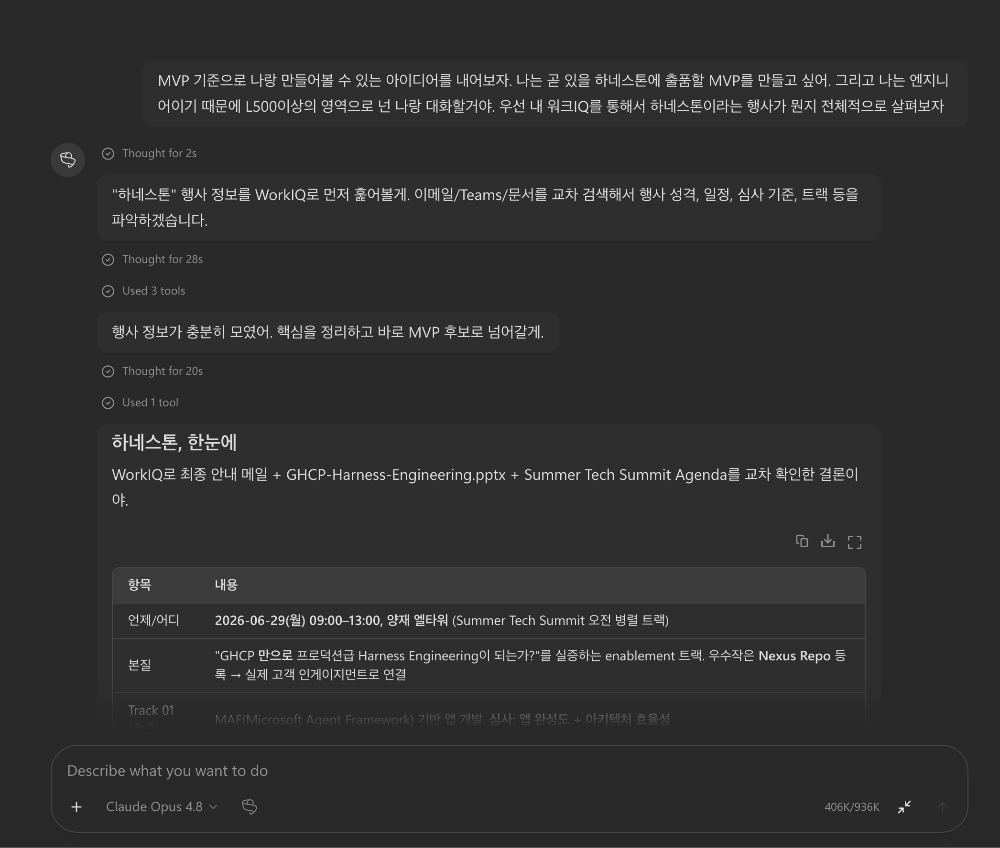
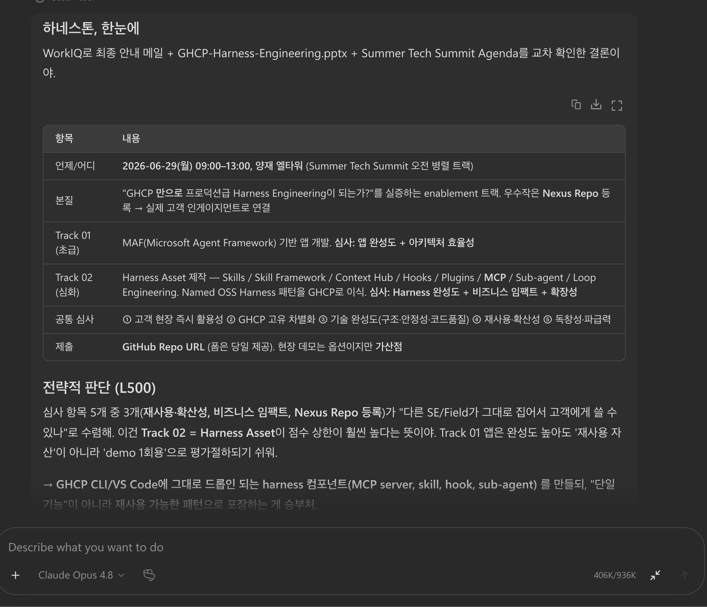
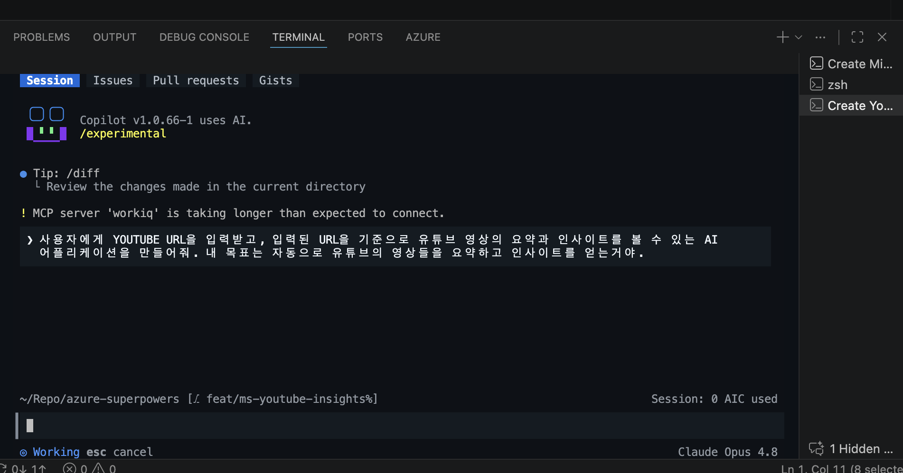
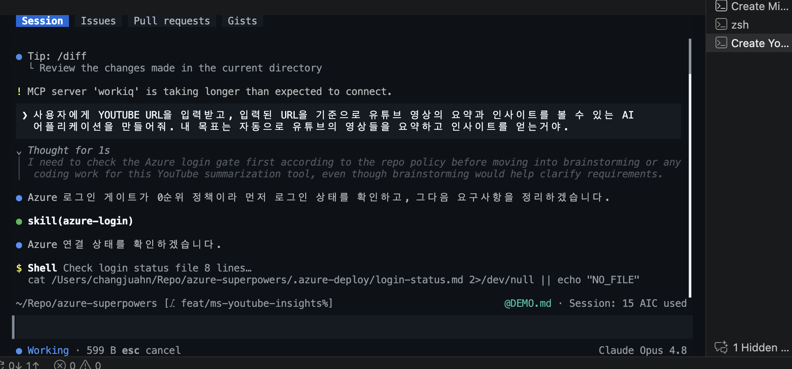
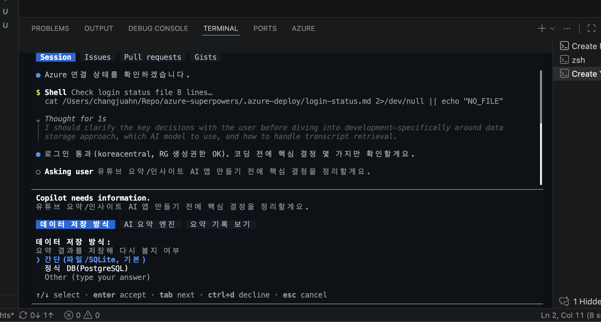
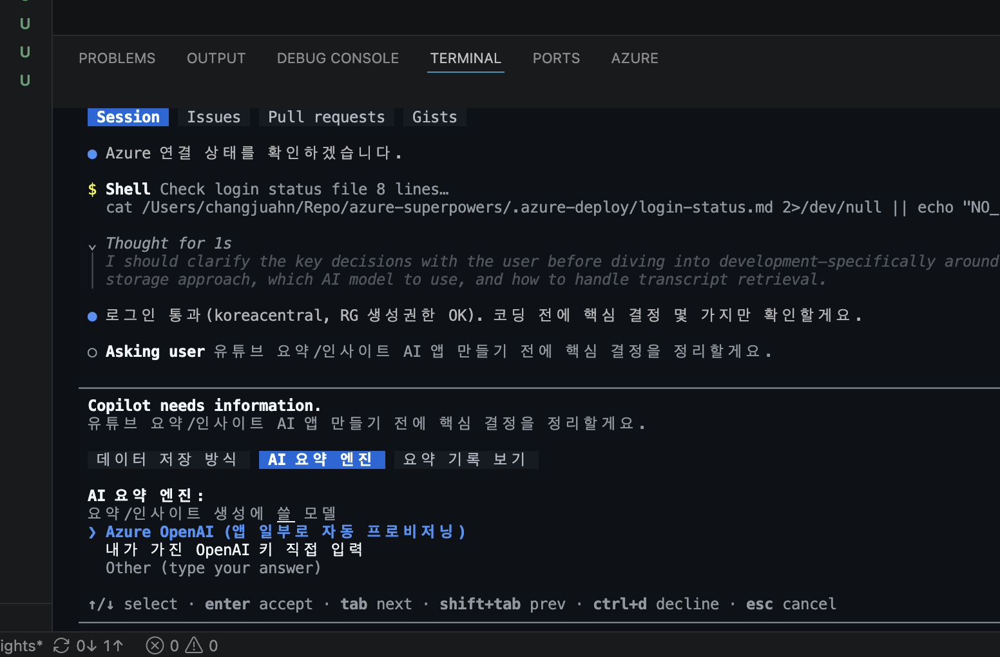
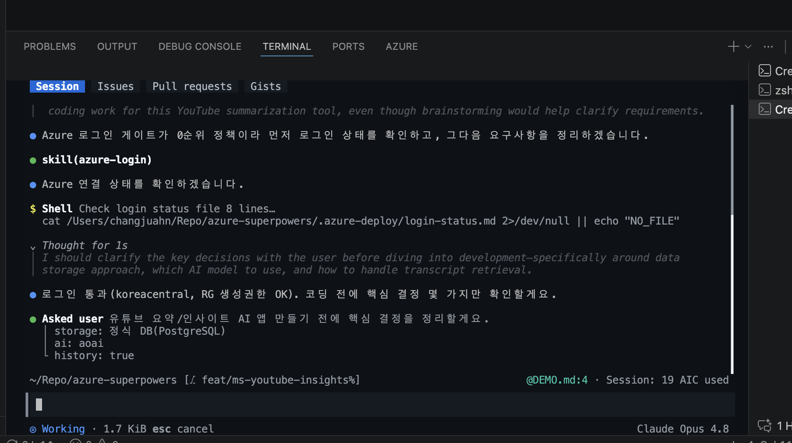
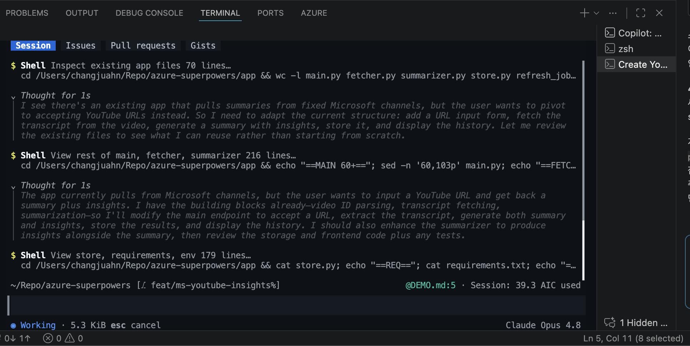
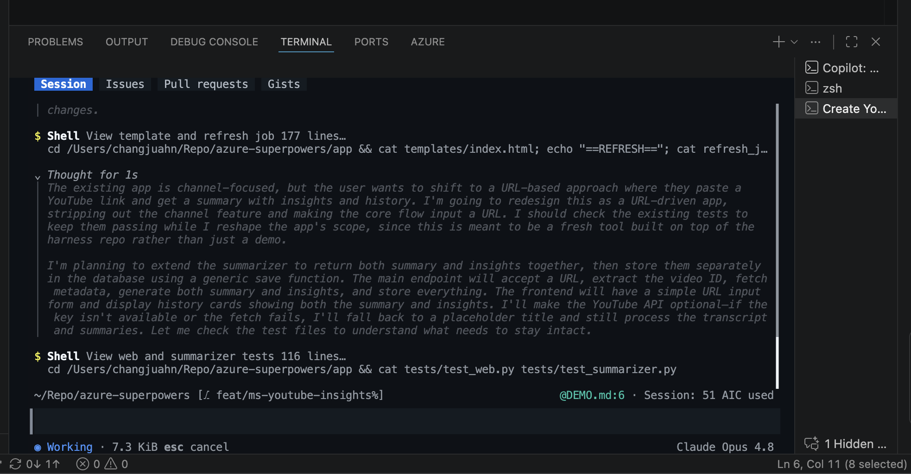
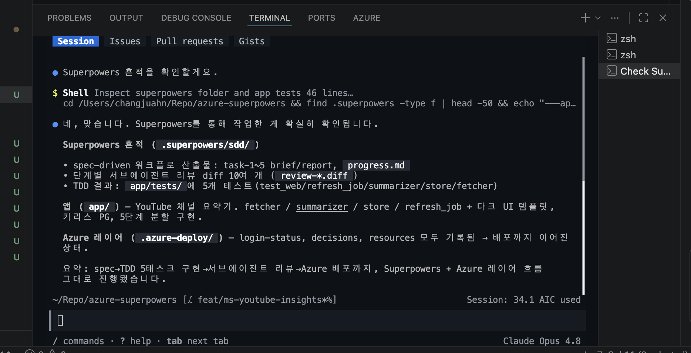
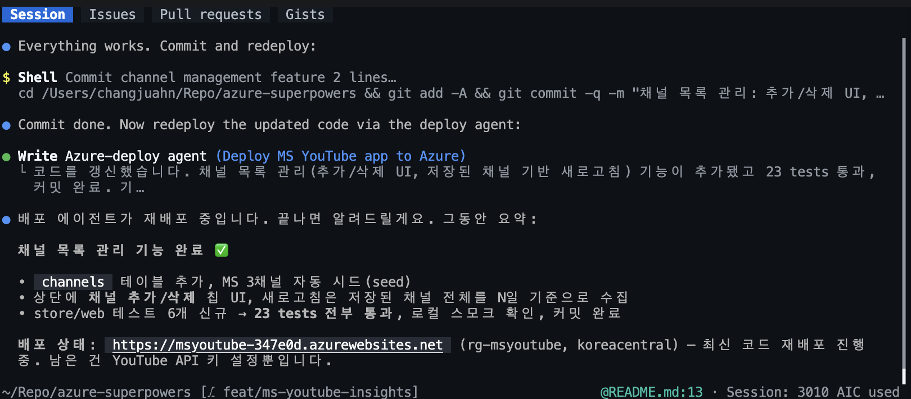
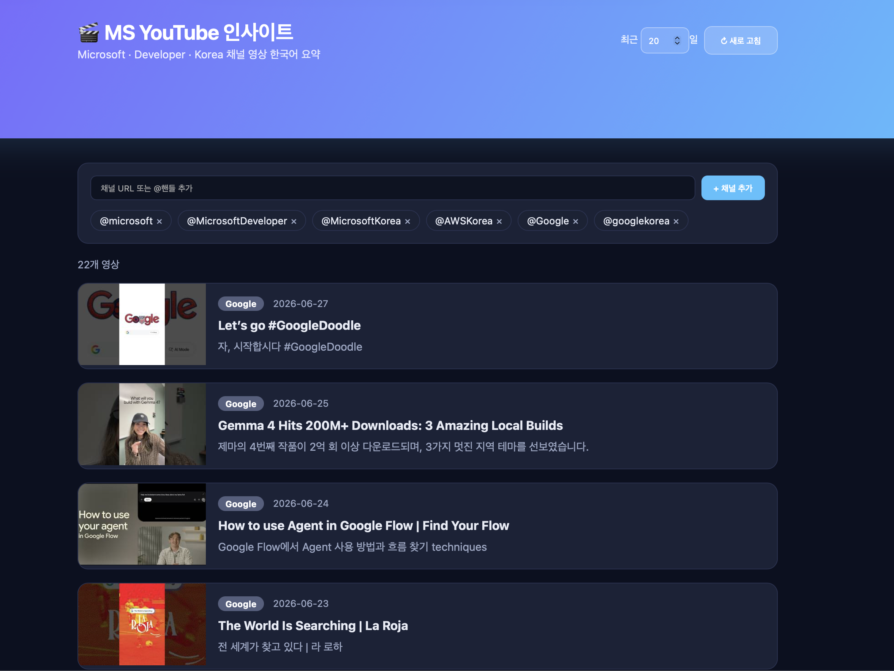