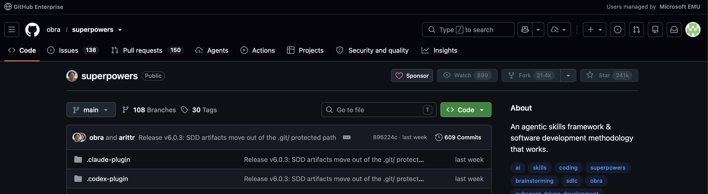
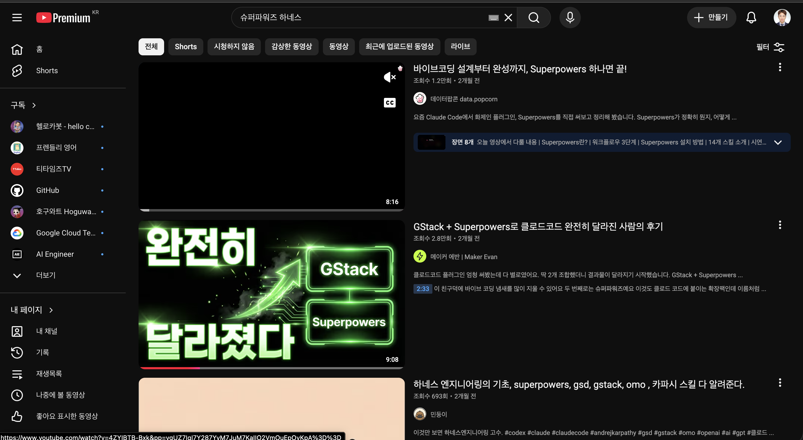

# azure-superpowers

> **Azure deployment layer for [Superpowers](https://github.com/obra/superpowers).**
> 가장 인기 있는 GHCP 하네스에 Azure를 입힌다 — 코드에서 멈추지 않고 **살아있는 Azure URL**까지.

가장 인기 있는 하네스를 이기려는 게 아니다. **Superpowers가 spec→TDD→리뷰로 코드를 완성**하면,
이 레이어가 그 뒤를 이어 **키리스·단일 RG**로 Azure에 띄운다. (obra/superpowers, MIT — 위에 얹는 애드온)

## 한 줄
Superpowers의 깊이 + Azure 배포 = 아이디어를 **GHCP만으로** Azure URL까지.



## 왜 시너지인가 — 1+1이 3
- **Superpowers**는 "잘 만든다"의 정점: 브레인스토밍·spec·TDD·리뷰로 **검증된 코드**. 그런데 끝이 코드라 노트북에 갇힌다.
- **Azure 레이어**는 "끝까지 간다"의 정점: 키리스·단일 RG로 **살아있는 URL**. 그런데 좋은 코드가 전제다.
- 둘을 붙이면 **아이디어 한 문장 → 검증된 코드 → 배포된 URL**이 한 흐름. 손이 끊기던 "코드↔배포" 간극을 azure 레이어가 메운다.
- 합쳐서 생기는 것: SP 단계가 끝나면 로그인 게이트→매핑→배포가 **자동으로 이어짐**(재확인 없이). 사용자는 az를 몰라도 URL을 받는다.

## 차별점
- **Superpowers엔 없는 Azure 배포**: App Service + DB까지. Superpowers가 쪼갠 스키마 → **Azure DB로**.
- **키리스(관리 ID)**: 유출될 키를 안 만든다.
- **단일 RG + 자원 대장**: `az group delete` 한 방으로 정리.
- 🪿 Azure 전용(AWS/GCP는 정중히 거절).

## 구조
```
install.sh                 # Superpowers 설치 + 이 레이어 안내
.github/
  copilot-instructions.md  # Superpowers 뒤 Azure 단계 잇기 + DB 선택 게이트
  agents/azure-deploy.md   # 배포자 (키리스, 단일 RG, URL)
  skills/azure-login/      # ⛔ 0순위: az 로그인·권한 체크부터
  skills/azure-provision/  # 리소스→Azure 매핑 (DB→Azure DB)
  instructions/keyless...  # 키리스·정리 가드레일
```

## 흐름 — Superpowers의 실행력 × Azure 배포
Superpowers가 아이디어를 검증된 코드로 만들고, 이 레이어가 그 코드를 살아있는 URL로 잇는다.

| 단계 | 주체 | 하는 일 |
|---|---|---|
| **0. 로그인 게이트** | 🪿 우리 | `azure-login`이 az 로그인·권한 확인 → `.azure-deploy/login-status.md` 기록. 실패 시 작업 중단 |
| **0.5 DB 선택** | 🪿 우리 | 간단(파일/SQLite) vs 정식(PostgreSQL). 정식이면 처음부터 PostgreSQL 전제로 코딩 |
| **1. 브레인스토밍** | 💪 SP | `brainstorming`으로 의도·요구·설계 탐색 |
| **2. 계획** | 💪 SP | `writing-plans`로 spec→단계별 구현 계획 |
| **3. TDD 구현** | 💪 SP | `test-driven-development` 빨강→초록→리팩터, 서브에이전트 병렬 |
| **4. 리뷰·검증** | 💪 SP | `requesting-code-review`+`verification-before-completion`으로 완성 보증 |
| **5. 매핑** | 🪿 우리 | `azure-provision`: 코드가 요구하는 리소스 → App Service·Azure DB로 |
| **6. 배포** | 🪿 우리 | `azure-deploy`: 키리스·단일 RG로 올려 🌐 URL, `resources.md` 기록 |

💪 SP = Superpowers(전역) · 🪿 = azure-superpowers(이 레이어)

## 시나리오로 보기 — 월요일 아침, 팀장의 한마디
> **상황.** 마케팅팀 김대리. 코딩은 못 한다. 팀장이 "이번 캠페인 신청 받는 방명록 페이지 하나 오늘 안에 띄워줘"라고 한다. 개발자는 다 바쁘다. 김대리에겐 GHCP와 이 폴더가 전부다.

| 시간 | 김대리가 한 말 | 안에서 벌어지는 일 |
|---|---|---|
| 09:10 | "캠페인 방명록 웹앱 만들어줘" | 🪿 **0순위 로그인 게이트** — 브라우저 창 한 번 클릭으로 az 로그인, 권한 OK. DB는 "정식(PostgreSQL)" 선택 |
| 09:12 | (지켜봄) | 💪 **Superpowers**가 브레인스토밍→spec→TDD로 등록 API·저장·테스트까지 **검증된 코드** 완성 |
| 09:40 | "Azure에 배포해줘" | 🪿 **끝까지 자동** — App Service + Azure DB 매핑, 키리스로 프로비저닝, `azd up` |
| 09:48 | 🌐 URL 받음 | 팀장에게 링크 전달. 키 한 줄 안 만들었고, 정리는 `az group delete` 한 방 |

**핵심**: 김대리는 `az`도 Bicep도 모른다. "만들어줘 → 배포해줘" 두 마디로 **검증된 코드 + 살아있는 URL**. 명성 높은 Superpowers의 깊이가 Azure 위에서 비전문가에게도 닿는다.

## 더 넓게 — 왜 "Azure로 확장"이 의미 있나
- **Superpowers의 명성**: spec·TDD·서브에이전트 리뷰로 "코드 잘 만드는" 하네스의 사실상 표준. 수많은 팀이 이미 신뢰.
- **그 깊이를 결과물로**: 잘 만든 코드도 배포가 안 되면 데모로 끝난다. 이 레이어가 그 마지막 1마일(키리스 배포·DB·정리)을 책임져 **"코드 = 제품"**으로 확장.
- **비개발자까지**: az/IaC 지식 없이도 사내 도구·MVP·캠페인 페이지를 직접 띄움 → AI 코딩의 수혜자가 개발자 너머로 넓어진다.

## Superpowers보다 Azure에 특화된 점
- **코드에서 안 멈춘다**: SP는 코드 완성이 끝. 우리는 App Service + Azure DB로 **실제 URL**까지.
- **키리스 강제(관리 ID + RBAC)**: 연결문자열·API 키를 코드/커밋에 절대 안 만든다. SP엔 없는 Azure 보안 기본기.
- **0순위 로그인 게이트 + 진단·가이드**: 시작부터 az 로그인·권한 확인. 실패하면 반환 에러로 원인을 짚어 **할 일까지 안내**(Contributor 역할 요청·테넌트 전환·리전·프로바이더 등록). "만들고 나서 배포 안 됨"을 원천 차단.
- **DB도 Azure로**: SP가 쪼갠 스키마를 Azure DB for PostgreSQL에 키리스로 연결.
- **단일 RG + 자원 대장**: 모든 자원을 `rg-<앱>`에. `az group delete` 한 방 정리, 비용 사고 방지.
- **한국·퍼블릭·최소 SKU 기본**, MVP 경계 분명. 🪿 AWS/GCP는 정중히 거절.

## 사용
```bash
# 1) 한 번만: Superpowers(전역) + Azure 레이어(이 폴더) 준비
bash install.sh

# 2) 이 폴더에서 Copilot 실행 (Azure 레이어가 로드됨)
cd azure-superpowers && copilot
```
그다음 평소처럼 Superpowers에게 말한다:
```text
"방명록 웹앱 만들어줘"        # → 0순위 로그인 게이트 → DB 선택 → Superpowers가 spec·TDD로 완성
"Azure에 배포해줘"           # → ⚡ 재확인 없이 provision/deploy까지 끝까지 → 🌐 URL
```
정리: `az group delete -n rg-<앱> --yes` 한 방.

> ⚡ **배포는 끝까지 자동**: "배포해줘" 한 번이면 멈추지 않고 azure.yaml/bicep 생성→`azd up`→URL까지 실제 실행. "준비됐다/진행할까요"로 멈추지 않는다 — URL이 나와야 끝. 실패할 때만 멈춰 원인·가이드.

전제: Azure 구독·권한. 범위 밖: 비용·스케일·모니터링.
